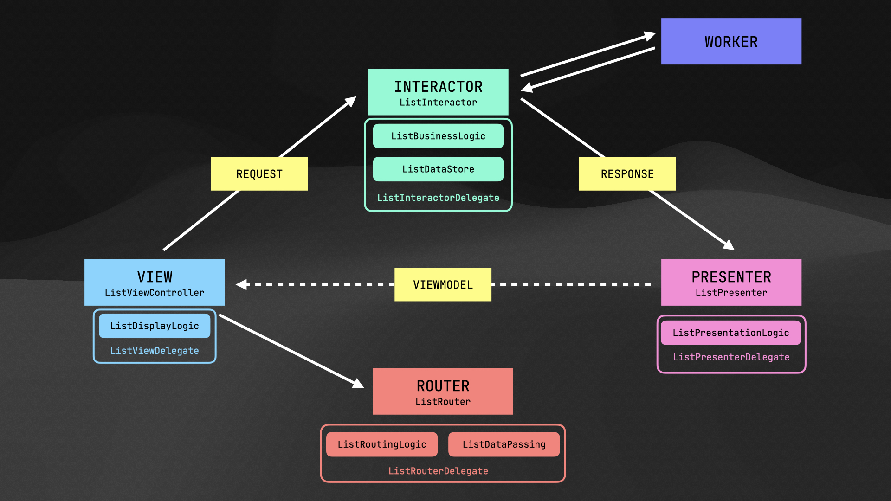

# VIPSession
Ejemplo de App iOS Swift implementando patrón de arquitectura VIP Clean Swift

Utilizando:

* [Alamofire](https://github.com/Alamofire/Alamofire)
* [AlamofireImage](https://github.com/Alamofire/AlamofireImage)
